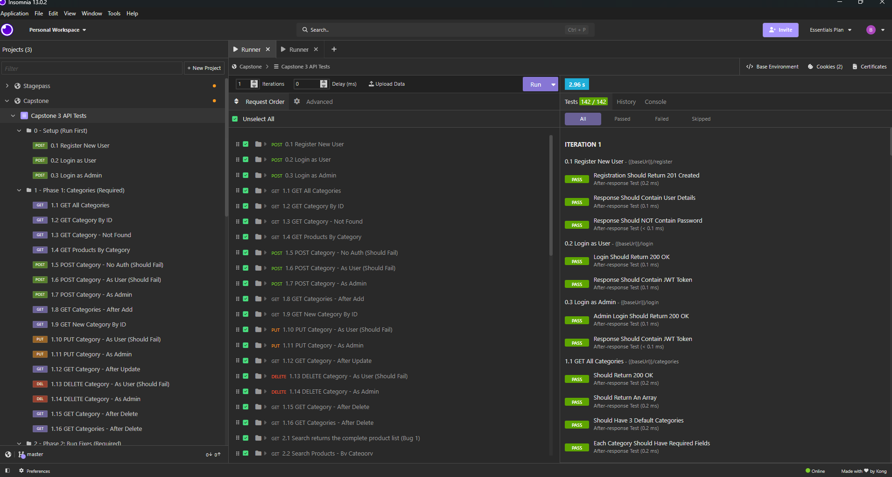
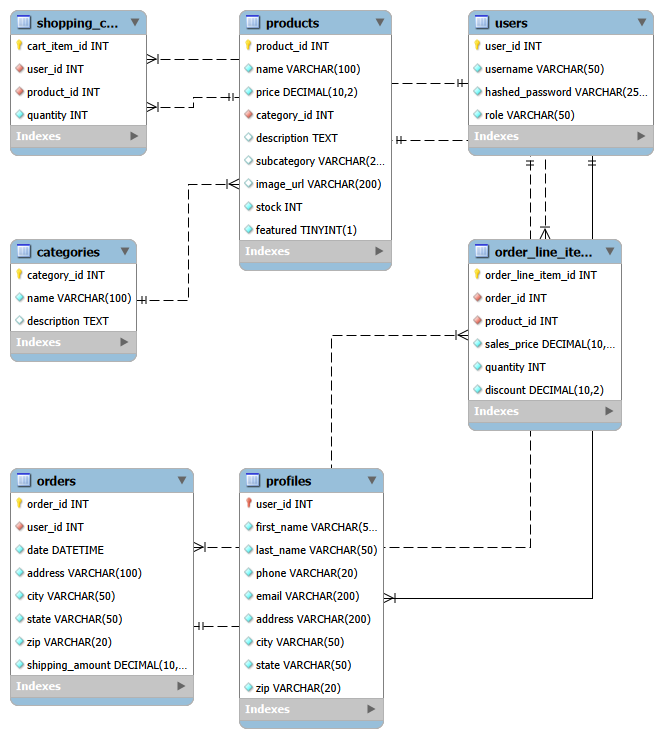

# 🎮 EasyShop API - Video Game Store 🎮
### A Spring Boot REST API generating an online video game store. Built as the backend for an e-commerce application with full shopping cart and checkout functionality.


## Overview:


This application was designed for online shoppers in general; it allows users to filter products by price, add items to their cart, and proceed to checkout. For this specific app, I was responsible for the backend development, which involved fixing bugs and implementing features such as the shopping cart and checkout.  
The project was divided into five phases: 
- Phase 1 involved implementing methods for categories; 
- Phase 2 focused on bug fixes and adding functionality to endpoints; 
- Phase 3 entailed implementing the shopping cart to ensure products were added correctly; 
- Phase 4 enabled users to update their profiles; 
- Phase 5 involved implementing the checkout feature, where the shopping cart is converted into an order.

## Built with:


- **Java 17 (Amazon Correto)** - Programming Language
- **Spring Boot 4.0.2** - Web Framework
- **Spring Data JPA** - Database Access Layer
- **Spring Security + JWT** - Authentication
- **MySQL Workbench** - Relational Database
- **Insomnia** - API testing


## Project Structure 📂


```
src/main/java/org/yearup/
├── controllers/     - REST endpoints (handle HTTP requests/responses)
├── models/          - JPA entities and response models
├── repository/      - Data access layer (Spring Data JPA)
├── security/        - JWT authentication & authorization
├── service/         - Business logic layer
└── ECommerceApplication.java    - Spring Boot entry point
```

## Screenshots


### Store Front End


### Insomnia Tests Passing



## Database Schema (ERD)





## How To Run:


### Setup

1. **Clone the repository**
```bash
   git clone https://github.com/beatrizjardim031/ecommerce-api.git
   cd ecommerce-api
```

2. **Create the database**
3. Open MySQL Workbench and run the SQL script for your chosen storefront:
```
database/videogamestore.sql
```
4. **Configure your database connection**
   Update `src/main/resources/application.properties` with your MySQL credentials.

5. **Run the application**
   Open the project in IntelliJ and run `ECommerceApplication.java`.

   The API will start on `http://localhost:8080`.

### Testing
- **Insomnia** → Import the collection from `/insomnia/` folder

### Demo Users

| Username | Password | Role |
|----------|----------|------|
| `user` | `password` | USER |
| `admin` | `password` | ADMIN |

## Interesting Code: Checkout Orchestration


For me, the piece of code I'm most proud of is the checkout() method in OrderService. It pulls together everything I learned in this capstone, taking a shopping cart and turning it into a permanent order through several coordinated steps.  
The `@Transactional` annotation wraps the entire method in sort of a safety bubble. If any step throws an exception, Spring **rolls back every change** made during this method, as if nothing ever happened.
```
@Transactional
public Order checkout(int userId) {
     ShoppingCart shoppingCart = shoppingCartService.getByUserId(userId);
     Profile profile = profileService.getById(userId).orElseThrow();

        if (shoppingCart.getItems().isEmpty()) {
            throw new ResponseStatusException(HttpStatus.BAD_REQUEST, "Cart is empty");
        }

        Order order = new Order();
        order.setUserId(userId);
        order.setDate(LocalDateTime.now());
        order.setAddress(profile.getAddress());
        order.setCity(profile.getCity());
        order.setState(profile.getState());
        order.setZip(profile.getZip());
        order.setShippingAmount(BigDecimal.ZERO);

        order = orderRepository.save(order);

        for (CartItem item : shoppingCart.getItems().values()) {
            OrderLineItem orderLineItem = new OrderLineItem();
            orderLineItem.setOrderId(order.getOrderId());
            orderLineItem.setProductId(item.getProductId());
            orderLineItem.setSalesPrice(BigDecimal.valueOf(item.getProduct().getPrice()));
            orderLineItem.setQuantity(item.getQuantity());
            orderLineItem.setDiscount(BigDecimal.ZERO);

            orderLineItemRepository.save(orderLineItem);
        }
        shoppingCartService.deleteCart(userId);

        return order;
}      
```

## Future Improvements


- Order History Endpoint: Allow users to track their order history.
- Calculate Shipping: Replace hardcoded shipping amount with logic based on destination.
- Order Status Tracking: pending, shipped or delivered states.

## AI Use Statement 🤖


I used Claude as a support tool for debugging, refactoring ideas, README polish, and learning guidance. I used it to review my code, think through edge cases, and improve the readability of the project.

The project theme, implementation choices, final code, and testing decisions were completed and reviewed by me.

- Getting feedback on layered architecture and service design
- Refactoring suggestions for the cart entity (@Transient)
- Thinking through edge cases like empty cart checkout
- Improving README wording and project explanation

**AI was used more like a tutor or code review partner, not as a replacement for building the project myself.**


## Author: 


Beatriz Jardim


